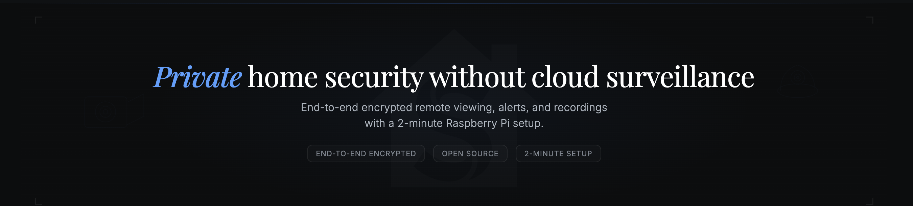

  

# Secluso

Private DIY home security for Raspberry Pi, with encrypted remote access and a 5-minute software setup.

[Download Secluso Deploy](https://github.com/secluso/secluso/releases) • [Build Your Own Guide](https://secluso.com/build-your-own) • [Security Model](WHITE_PAPER.md) • [Website](https://secluso.com)

Secluso is a private home security camera system for Raspberry Pi. Watch live video, get alerts, and open recordings from your phone without handing your footage to a cloud provider.

Secluso is developed by Secluso, Inc. and co-founded by Ardalan Amiri Sani, a UC Irvine professor with expertise in computer security and privacy.

## Features

- **End-to-end encrypted remote access:** Watch live video, get alerts, and open recordings from your phone.
- **5-minute setup:** Secluso Deploy handles image building, pairing, and relay setup in the normal path.
- **Open source:** Inspect the code, self-host it, and contribute.
- **Fully reproducible releases:** Verify the released runtime binaries, deploy tool, Android mobile app and Secluso OS against the public source code.

## Requirements

- **Raspberry Pi:** Raspberry Pi Zero 2W
- **Camera:** Raspberry Pi Camera Module V1
- **Relay:** your own Linux VPS login, or an email to us for free beta relay hosting while testing
- **Phone:** Android or iPhone for pairing, alerts, and playback

## Set up in 5 minutes (Quick Start)

1. Download **Secluso Deploy** from the [latest releases](https://github.com/secluso/secluso/releases).
2. Generate your personalized Secluso OS image and camera secret QR code locally
3. Let Secluso Deploy provision your relay over SSH, or email us if you want free beta relay hosting while testing.
4. Boot the Pi and pair it in the mobile app.

If you are still choosing hardware or a VPS, [Build Your Own Guide](https://secluso.com/build-your-own) gives you hardware suggestions and a simple starting path.

  

<!--
TODO: A polished GIF showing Secluso Deploy 
-->

## Mobile App

After setup, use the mobile app to check in remotely, review recent events, and open encrypted clips.

  

<!--
TODO: A polished GIF of multiple views of the mobile app
-->

## Security

See [SECURITY.md](SECURITY.md) for the full security model, including the untrusted-relay design, forward secrecy, and post-compromise security.

## Reproducible Builds

We do distribute a prebuilt Raspberry Pi image called "Secluso OS". Secluso Deploy generates unique credentials on your machine and injects them into this prebuilt image. Secluso OS, the deploy tool, our runtime binaries, and our Android app are completely reproducible.

See [releases/README.md](releases/README.md) for the reproducibility checker for the binaries and deploy tool. See [mobile_client/tool/repro/README.md](https://github.com/secluso/mobile_client/blob/main/tool/repro/README.md) for the reproducibility checker for the Android mobile app. See [os/README.md](https://github.com/secluso/os) for the reproducibility checker for Secluso OS. The image must be checked before the deploy tool modifies it (download from our releases directly).

## Documentation and Help

Need hardware suggestions, a starter VPS, or a short BYO walkthrough? See [Build Your Own](https://secluso.com/build-your-own). If you get stuck, email [secluso@proton.me](mailto:secluso@proton.me). We are happy to help whether or not you ever buy from us.

## Contributing

Questions and contributions are welcome. Contributions are made under the project license in [LICENSE](LICENSE).

## Project Founders

- Ardalan Amiri Sani (UC Irvine professor focused on computer security and privacy)
- John Kaczman (Open source and privacy enthusiast with experience in automation, systems, and AI)

Secluso is developed and supported by Secluso, Inc.

## Disclaimers

This project uses cryptography. Check your local laws before use.

Use at your own risk. The project authors provide no guarantees of privacy or home security.
